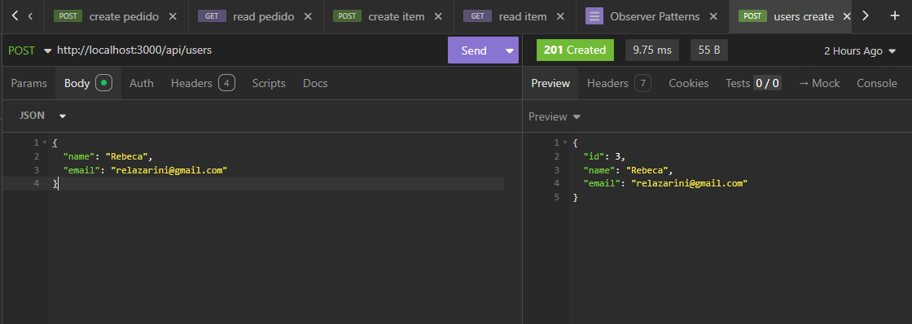
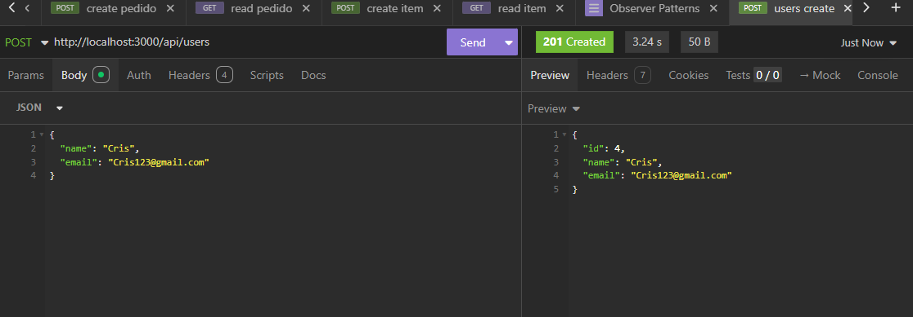

# patterns-Observer

## Observer

- O Observer, ele permite que objetos se "inscrevam" par receber notificações quando outro
objeto sofre uma mudança. Deste modo, os objetos podem sempre se manter atualizados quando
houver alguma mudança.

- Quando usar?
  - Quando uma mudança em um objeto precisa refletir em outros sem acoplamento forte.
  - Em sistemas de eventos, como interfaces gráficas (ex: listeners).
  - Em sistemas de publish/subscribe.

- Dentro de  Observer, possui duas entidades principais: 

 .Entidade 1 (Observer)
- Ele permite que objetos sejam notificados quando outro objeto sofre uma mudança. Deste modo, os objetos podem sempre se manter atualizados quando houver alguma mudança(sem qua haja uma ligação direta entre eles).
 . Entidade 2 (Subject)
- Ele é o objeto que será observado, é responsável pelas mudanças que o Observer notifica.

## Tecnologias
- IDE (VsCode)
- patterns-Observer
- JavaScript
- Prisma 
- Mysql

## Como testar
- Clone o repositório
- Intale as seguintes dependencias
```bash
cd api 
npm i
```
- Crie o arquivo . env na raiz do projeto com a seguintes variaveis de a,mbiente:
````bash
DATABASE_URL="mysql://root@localhost:3306/users"
````

- Migre o bando de dados 
```bash
npx prisma migrate dev --name init
```
- Inicie o servidor 
```bash
npx nodemon
```


http://localhost:3000/api/users
- No insomnia 
{
  "name": "user",
  "email": "uaser123@gmail.com"
}





github BY: rebecalazarini e CrislaineL


apresentação: https://www.canva.com/design/DAGmCqGuGes/VnAOqwT2Ka6MDqQHyx3AHQ/edit

